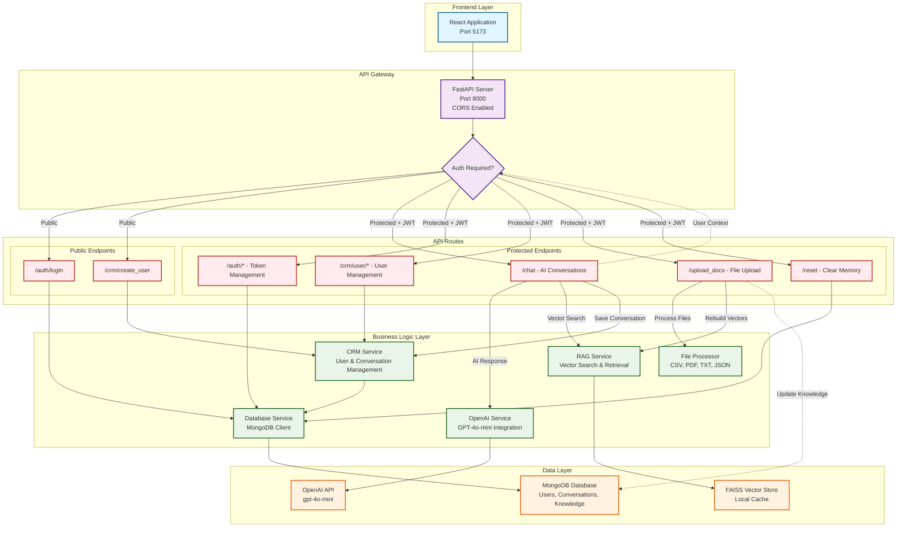

# RentRadar - System Architecture

## CRM Schema

### MongoDB Collections Schema

#### Users Collection
```json
{
  "_id": "ObjectId",
  "name": "string",
  "email": "string (unique)",
  "company": "string",
  "preferences": "string",
  "password": "string (hashed)"
}
```

#### Conversations Collection
```json
{
  "_id": "ObjectId",
  "user_id": "ObjectId (references users._id)",
  "category": "string (property_search/general_inquiry/pricing_inquiry)",
  "messages": [
    {
      "role": "string (user/assistant)",
      "content": "string",
      "timestamp": "ISODate"
    }
  ],
  "is_active": "boolean",
  "created_at": "ISODate",
  "updated_at": "ISODate"
}
```

#### Knowledge Base Collection
```json
{
  "_id": "ObjectId",
  "content": "string",
  "metadata": {
    "source": "string",
    "address": "string",
    "monthly_rent": "number",
    "square_footage": "number",
    "building_class": "string",
    "property_type": "string",
    "amenities": "array"
  },
  "created_at": "ISODate"
}
```

## System Architecture Diagram



## System Components

### 1. Client Layer
- **Web UI / API Client**: Frontend applications consuming the REST API

### 2. API Gateway
- **FastAPI Server**: Main application server running on port 8000
- **CORS Middleware**: Cross-origin resource sharing configuration

### 3. Authentication Layer
- **JWT Middleware**: Token verification for protected endpoints
- **Authentication Check**: Determines if endpoint requires authentication

### 4. Public Endpoints (No Authentication Required)
- **Login Routes** (`/auth/login`): User authentication
- **Registration Routes** (`/crm/create_user`): New user registration

### 5. Protected Endpoints (JWT Authentication Required)
- **Chat Routes** (`/chat/*`): AI conversations with RAG integration
- **Auth Management** (`/auth/me`, `/auth/verify`, `/auth/logout`): Token operations and authorization
- **User Management** (`/crm/user/*`, `/crm/update_user/*`, `/crm/conversations/*`): Profile and conversation management
- **File Upload** (`/upload_docs/`): Document upload and processing
- **Reset Operations** (`/reset`): Clear conversation memory

### 6. Services Layer
- **OpenAI Service**: Integration with GPT-4o-mini for chat responses
- **RAG Service**: FAISS vector store for retrieval-augmented generation
- **CRM Service**: User profile and preference management
- **Database Service**: MongoDB connection and operations

### 7. Data Processing
- **helpers.py**: Centralized file processing utilities
- **File Processors**: Support for CSV, PDF, TXT, JSON formats

### 8. External Services
- **OpenAI API**: GPT-4o-mini for natural language processing
- **MongoDB**: Document database
- **FAISS Vector Store**: Local vector database for semantic search

### 9. Database Collections
- **users_collection**: User profiles and preferences
- **conversations_collection**: Chat history and metadata
- **knowledge_base_collection**: RAG document store

## Data Flow

### Chat Request Flow
1. Client sends message to `/chat` endpoint
2. JWT middleware extracts user context (ID, email, company, preferences)
3. RAG service performs semantic search on knowledge base
4. OpenAI service generates personalized response using user context + RAG results
5. Conversation saved to MongoDB with category classification
6. Response returned with metadata (response time, category)

### Document Upload Flow
1. Client uploads file to `/upload_docs/` endpoint
2. File processor (CSV/PDF/TXT/JSON) extracts structured content
3. Existing knowledge base cleared from MongoDB
4. New documents inserted into knowledge_base_collection
5. FAISS vector store rebuilt from new documents
6. Upload confirmation returned with vector store status

## Security Features
- **JWT Bearer Token Authentication**: Secure token-based user authentication
- **Selective Authentication**: Public endpoints for login/registration, protected endpoints for user operations
- **User Identity Verification**: Protected endpoints validate user can only access their own data
- **Token Validation**: All protected endpoints verify JWT tokens via `verify_token` dependency
- **User Context Isolation**: Conversations and profiles linked to authenticated users
- **File Type Validation**: Only allowed file formats accepted for uploads
- **Password Hashing**: bcrypt encryption for stored passwords
- **HTTP-only Cookies**: Secure cookie storage for authentication tokens

## Scalability Considerations
- **Stateless Design**: Each request is independent
- **Microservice Architecture**: Services are loosely coupled
- **Vector Store Rebuilds**: Efficient FAISS operations
- **Database Indexing**: MongoDB collections optimized for queries
